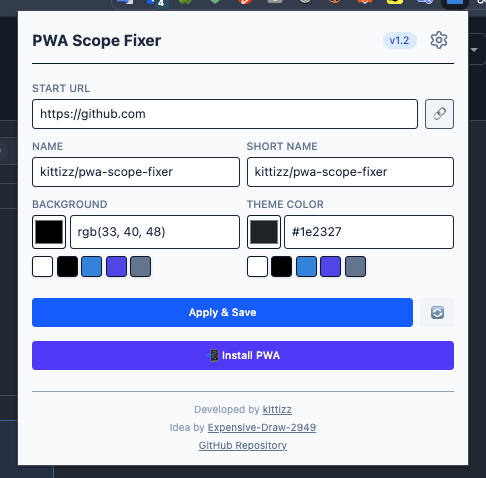

# PWA Scope Fixer

[](https://chromewebstore.google.com/detail/paddiikjoldefcflfofcjldejikppcca)

**PWA Scope Fixer** is a Chrome/Chromium extension designed to fix Progressive Web App (PWA) scope issues, specifically addressing the problem where the browser address bar remains visible or the PWA scope is too restricted (e.g., when installing a PWA from a subdirectory).

It allows you to inject a dynamic web manifest with a custom `start_url` and `display: standalone` property, forcing the browser to treat the site as a proper PWA with the correct scope.



## Features

- **Custom PWA Manifest Injection**: Dynamically injects a manifest into any website.
- **Fix Address Bar Issues**: Forces `display: standalone` to remove the browser address bar in installed PWAs.
- **Customizable Scope**: Set your own `Start URL` to define the PWA's root scope.
- **Customize PWA Appearance**:
  - Set **App Name** and **Short Name**.
  - Customize **Background Color** and **Theme Color**.
- **One-Click Install**: Trigger the PWA installation prompt directly from the extension popup.
- **Per-Site Settings**: Automatically saves your configuration for each domain.
- **Manage Chrome Apps**: easy access to `chrome://apps` to manage or uninstall bad PWAs.

## Why use this?

Sometimes when you install a PWA (e.g., from a specific page like `example.com/app/`), the browser might restrict the PWA's scope to that folder. This can cause:
1. The address bar to appear when you navigate elsewhere on the domain.
2. The PWA to not behave like a native app.

This extension solves this by letting you define the `start_url` (e.g., to the root `example.com/` or any other path) and injecting a correct manifest before you install it.

## Installation

### Chrome Web Store
[**Download PWA Scope Fixer**](https://chromewebstore.google.com/detail/paddiikjoldefcflfofcjldejikppcca)

### Manual Installation (from source)

1. Clone this repository.
2. Install dependencies with [Bun](https://bun.sh/):
   ```bash
   bun install
   ```
3. Build the extension:
   ```bash
   bun run build
   ```
4. Load into Chrome/Edge:
   - Go to `chrome://extensions/`.
   - Enable **Developer mode**.
   - Click **Load unpacked**.
   - Select the `dist` folder generated by the build.

## Usage

1. Navigate to the website you want to install as a PWA.
2. Click the **PWA Scope Fixer** extension icon.
3. Configure your settings:
   - **Start URL**: The root URL for your PWA (e.g., delete the path to make it root-scoped).
   - **Name**: The name of your app.
   - **Colors**: Customize the look.
4. Click **Apply & Save**.
5. Click **📲 Install PWA** (if available) or use the browser's install button.
6. If the install prompt doesn't appear, refresh the page and try again.

> **Tip:** If installation fails or "Open in Chrome" appears instead, go to `chrome://apps/`, delete the existing app, and try again.

## Development

This project uses [Bun](https://bun.sh/) and [React](https://react.dev/).

- **Install dependencies**: `bun install`
- **Watch mode (Hot Reload)**: `bun run dev`
- **Build for production**: `bun run build`
- **Package (.zip)**: `bun run pack` (Create a zip file for distribution)

## Credits

- Developed by **[kittizz](https://github.com/kittizz)**.
- Original idea by **Expensive-Draw-2949** on [Reddit](https://www.reddit.com/r/MicrosoftEdge/comments/1f74e7j/comment/n1ntpql/).

## License

MIT
